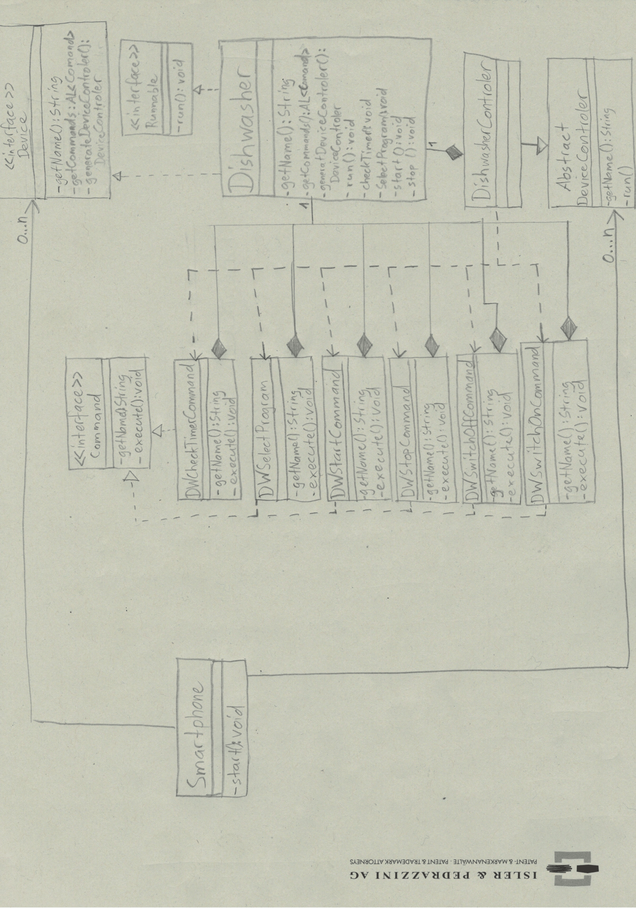

# BINF4241-group18

Note: In this diagram only the dishwasher implementation is shown. However,
all the other devices are implemented in the exact same manner, just with different
class and method names.
