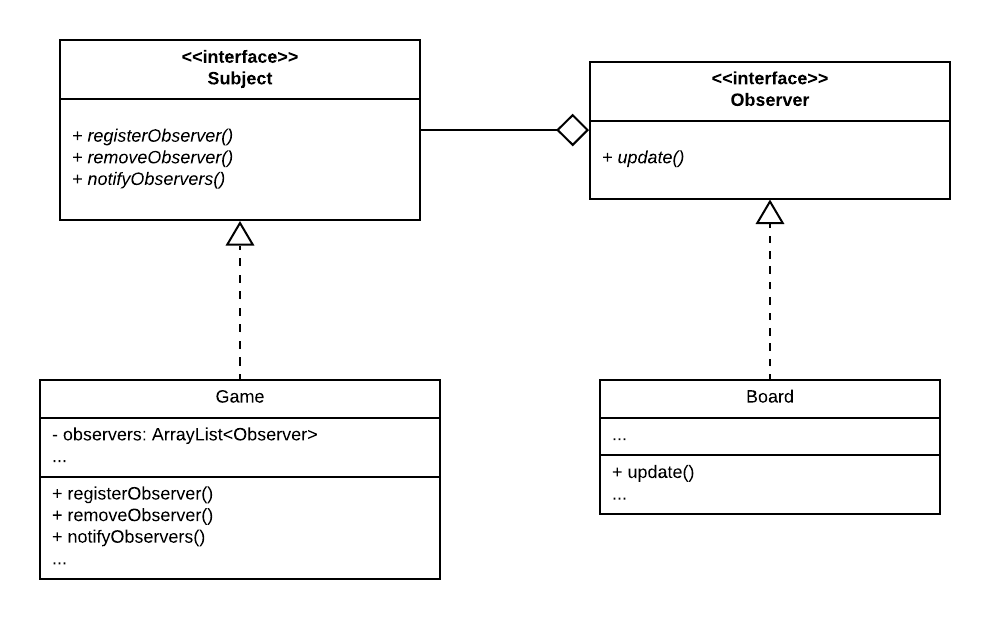
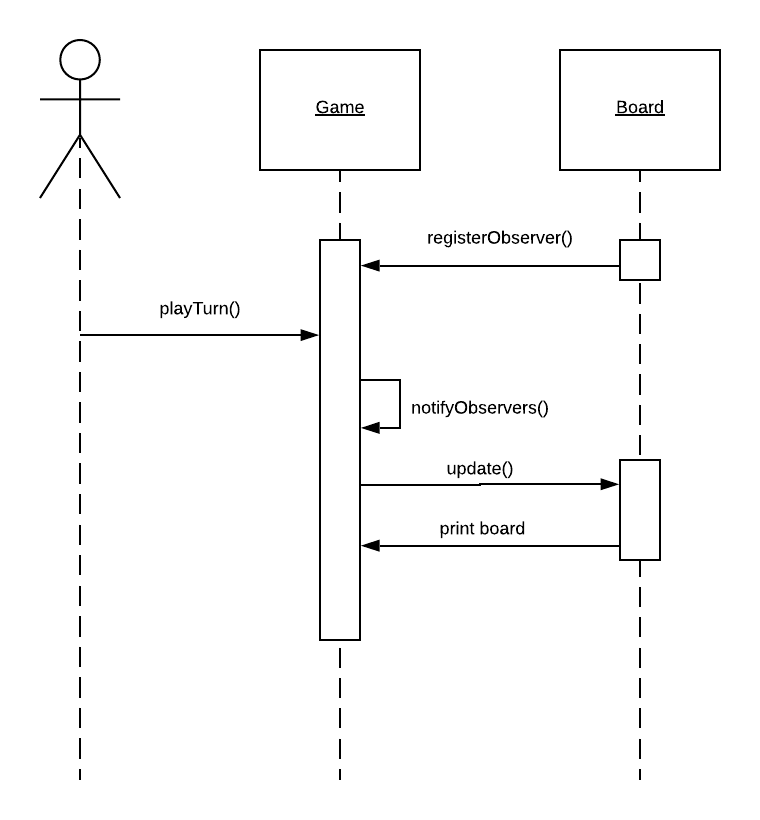

# Software construction - Assignment 3

## Part 1

#### Pattern 1: Singleton

**Why?** Assumption: In order for this pattern to make sense we assume that there will
always also only be 1 Game instance. In that case there should under no circumstances exist
a chance for two different boards to exist. If the Board is a singleton it can be guaranteed,
that all the figures, players etc. access the exact same board. Also, it would allow us to
no longer pass the board to our figure constructors because they could just get access to it by calling Board.getInstance().
  
**How?** The Board constructor is made private and thus not callable from outside the class. At application start,
the Board class itself calls its constructor and safes it in a private field. For any other class to get access to
the board instance, it has the possibility to get it via the getInstance() method, which is a static method of board.

###### Class Diagram

###### Sequence Diagram

#### Pattern 2: Observer

**Why?** Every time a player finishes her/his turn the board should be updated.
If you have an observer in place to do that, you could add multiple different instances to the observers that update
something at the end of each turn. Currently there is only a 1 observer, namely the board, which prints an updated version
after every turn. 

**How?** The Game implements the Subject interface and registers the Board observer. Then, after
every turn it calls its notifyObserver() method which currently then calls the update() method of all its
observers. This is currently only 1, namely the board. Because the board implements the Observer interface, it has to have the
update() method defined, which prints the current state of the board to the console.

###### Class Diagram

###### Sequence Diagram

## Part 2

## Part 3