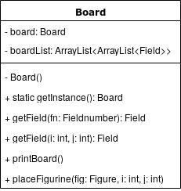
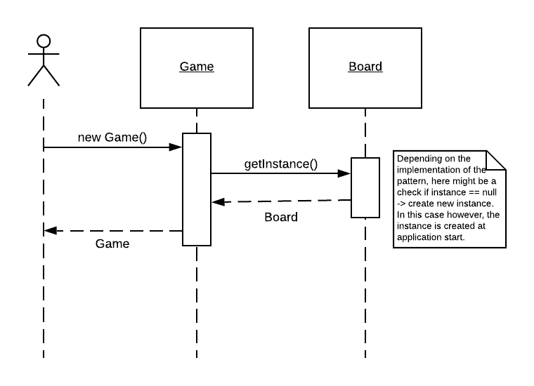

# Software construction - Assignment 3

## Part 1

#### Pattern 1: Singleton

1. **Why?** Assumption: In order for this pattern to make sense we assume that there will
 always also only be 1 Game instance. In that case there should under no circumstances exist
 a chance for two different boards to exist. If the Board is a singleton it can be guaranteed,
  that all the figures, players etc. access the exact same board. Also, it would allow us to
  no longer pass the board to our figure constructors because they could just get access to it by calling Board.getInstance().
  **How?** The Board constructor is made private and thus not callable from outside the class. At application start,
  the Board class itself calls its constructor and safes it in a private field. For any other class to get access to
  the board instance, it has the possibility to get it via the getInstance() method, which is a static method of board.
2. 
Class Diagram

3.
Sequence Diagram

#### Pattern 2: Observer

1. Why? How? 
2.
3.

## Part 2

## Part 3